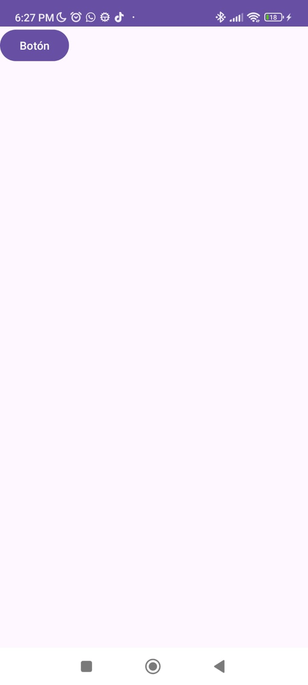
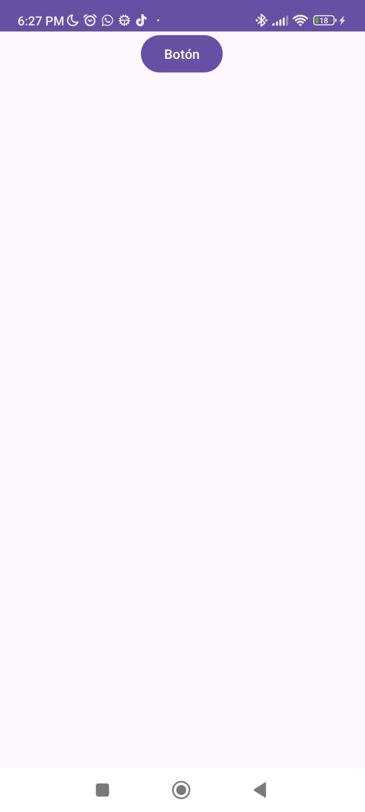
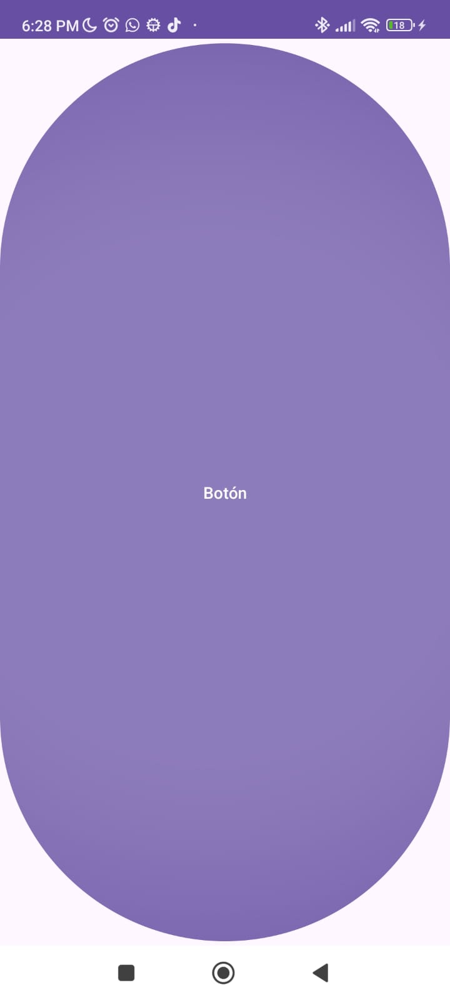
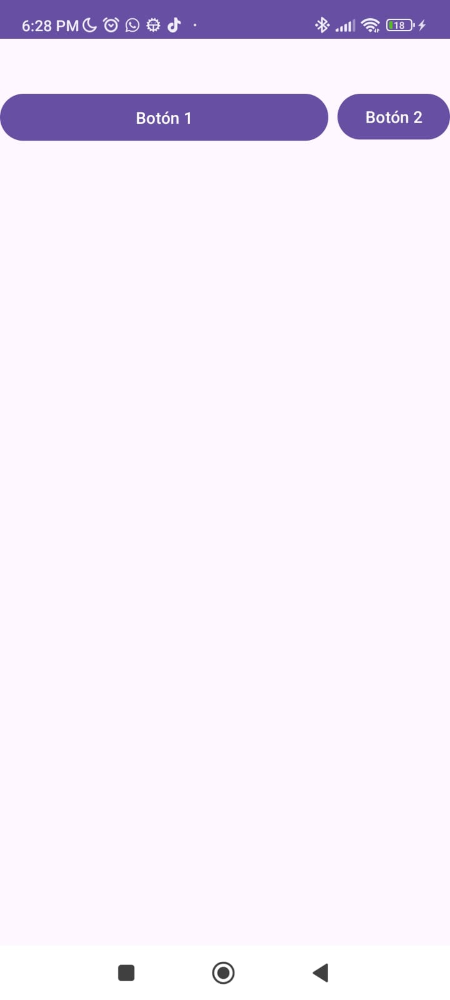
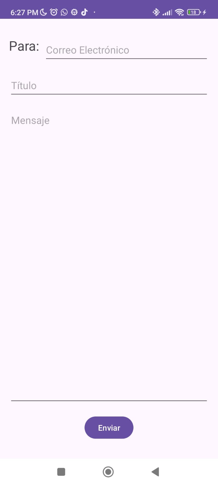
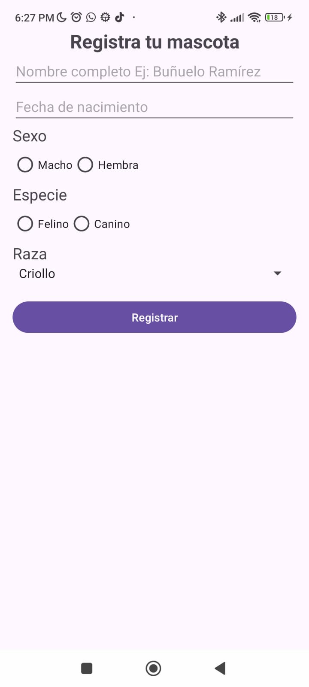

**Laboratorio Constraint Layout**

Del Ejercicio 1 al 4 se hace uso de distintas formas para organizar los botones en un Constraint Layout, Ejercicio 5 una interfaz para envío de correos y Ejercicio 6 interfaz para registrar una mascota

